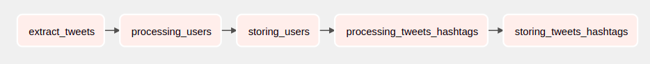
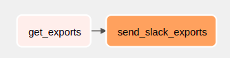

# Aegro academy - Dados

# 🏁 Indice
- [Sobre](#-sobre)
- [Tecnologias Utilizadas](#%EF%B8%8F-tecnologias-utilizadas)
- [Desenvolvedores](#desenvolvido-por)
- [Como baixar e executar o projeto](#-como-baixar-e-executar-o-projeto)
- [Disponivel em](#disponivel-em)

## 🔖&nbsp; Sobre
O projeto consiste em um pipeline de dados que adquire dados da API aberta do Twitter e grava em um banco de dados.
Os seguintes dados, baseado na hashtag escolhida e somente no idioma Português, são exportados e disponibilizados 
através da slack webhook diariamente após finalizar as configurações:
1. O total de tweets;
2. Os cinco usuários com mais seguidores;
3. O total de tweets agrupados por dia.

### Diagrama Entidade-Relacionamento
[](https://dbdiagram.io/d/62621a901072ae0b6acacee2)

O projeto possui duas DAGs, uma para adquirir dados da API aberta do Twitter e gravar no banco de dados, twitter_processing, e outra para exportar os dados e enviá-los no slack, twitter_exporting. Veja os diagramas de cada DAG abaixo: 
### Diagrama da DAG twitter_processing


### Diagrama da DAG twitter_exporting


### Exemplo de Exportações
```json
{
    "hashtag": "bolhadev",
    "total_tweets": 397,
    "five_users_with_most_followers": [
        {
            "name": "Andre Noel",
            "username": "ProgramadorREAL",
            "total_followers": 46035
        },
        {
            "name": "Rocketseat",
            "username": "rocketseat",
            "total_followers": 35834
        },
        {
            "name": "ruruzinho",
            "username": "slashante",
            "total_followers": 14028
        },
        {
            "name": "João Paulo 🇧🇷🇵🇹",
            "username": "joaopaulolndev",
            "total_followers": 4296
        },
        {
            "name": "Evaldo Maciel -Dinho",
            "username": "DinhoPutz",
            "total_followers": 3136
        }
    ],
    "total_tweets_group_by_date": [
        {
            "total": 112,
            "date": "2022-06-05"
        },
        {
            "total": 285,
            "date": "2022-06-06"
        }
    ]
}
```
---
## ⚒️ Tecnologias utilizadas
O projeto está sendo desenvolvido utilizando as seguintes tecnologias

- [Python](https://python.org/)
- [PostgreSQL](https://www.postgresql.org/)
- [AirFlow](https://airflow.apache.org/)
- [Docker](https://www.docker.com/)
- [Git](https://git-scm.com/)

---
## 🗂 Como baixar e executar o projeto

### Pre-requisitos
Antes de começar, você vai precisar ter instalado em sua máquina as seguintes ferramentas: Git, Python, Docker, Docker-Compose e Postgres (Links estão disponiveis na sessão Tecnologias utilizadas). 

### Baixando o projeto
```bash
    # Clone este repositório
    $ git clone https://github.com/jacyirice/aegro-academy-dados

    # Acesse o diretorio do projeto
    $ cd aegro-academy-dados
```

### Configurando a conta de desenvolvedor do Twitter
Na pagina de [desenvolvedores do twitter](https://developer.twitter.com/), siga os seguintes passos:
1. Se não tiver, crie uma conta no twitter como desenvolvedor e realize o login;
2. Crie um projeto para a versão 2 da API;
3. Nos detalhes do projeto, entre em Keys and tokens, copie a Bearer Token e guarde.

### Configurando o Banco de dados(PostgreSQL)
Na pasta do projeto, execute o arquivo create_tables.sql no SGBD para que sejam criadas as tabelas necessarias, conforme o DER. Após, configure para aceitar conexões externas.

### Configurando Slack WebHook
Na [API do slack](https://api.slack.com/apps), siga os seguintes passos:
1. Crie um novo app(From scratch);
2. Configure o nome do app e o workspace que ele irá usar;
3. Em Add features and functionality, ative Incoming Webhooks;
4. Clique no botão Add New Webhook to Workspace que aparecerá no fim da pagina, 
5. Selecione o canal em que será enviadas as exportações e clique em permitir.
5. Copie e guarde a WebHook URL que aparecerá. Exemplo de url: https://hooks.slack.com/services/XXXXXXX/XXXXXXXXX/XXXXXXXXXXXXXX

### Configurando o AirFlow
Obs.: As configurações abaixo foram validadas no SO Linux. Caso tenha algum problema em outros sistemas operacionais, consulte a [documentação](https://airflow.apache.org/docs/apache-airflow/stable/start/docker.html)

Faça as configurações iniciais do AirFlow
```bash
    # Configurando o usuário correto do Airflow
    $ mkdir logs/ plugins/
    $ echo -e "AIRFLOW_UID=$(id -u)" > .env

    # Inicializando o banco de dados
    $ docker-compose up airflow-init

    # Iniciando AirFlow
    $ docker-compose up
```
Acesse o webserver do AirFlow, disponivel em http://localhost:8080. A conta padrão tem o login airflow e a senha airflow. 
Após realizar o login, crie as seguintes connections(Admin -> Connections):
1. Conexao com o banco de dados
    - Connection Id: db_aegro_postgres
    - Connection Type: Postgres
    - Host: Insira o ip da sua maquina(Não insira localhost)
    - Schema: Nome do schema que criou as tabelas
    - Login: Login do seu banco
    - Password: Senha do seu banco
2. Slack Webhook
    - Connection Id: slack_conn
    - Connection Type: Slack Webhook
    - Host: https://hooks.slack.com/services/
    - Password: Parte posterior a https://hooks.slack.com/services/ na WebHook URL que foi criada em Configurando Slack WebHook. Exemplo: para a url https://hooks.slack.com/services/ABCDEFG/XXXXXXXXX/XXXXXXXXXXXXXX, o password é ABCDEFG/XXXXXXXXX/XXXXXXXXXXXXXX

Crie a seguinte variavel(Admin -> Variables):
- Key: TWITTER_BEARER_TOKEN
- Val: Bearer token gerado anteriormente na api do twitter

Aguarde um momento até que as DAGs recarreguem e os erros desapareçam. Por fim, ative as DAGs twitter_processing e twitter_exporting.

## Desenvolvido por
[Jacyiricê Silva Oliveira](https://github.com/jacyirice/)

## Disponivel em 
[GitHub](https://github.com/jacyirice/aegro-academy-dados)